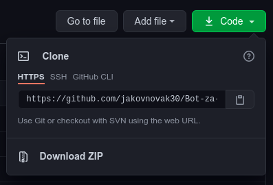
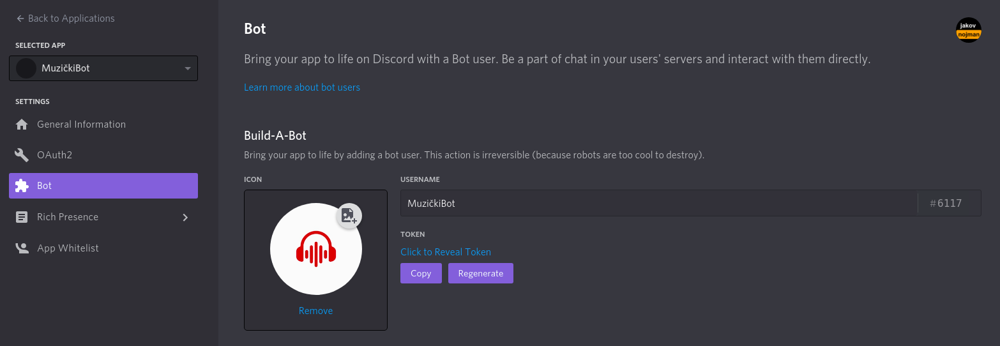

# Bot-za-discord 

O botu
---
* jednostavni kod za bot koji pušta muziku

Instalacija bota
---
#### Ako imate git CLI
	* otvorite terminal u mapi u koju želite spremiti bota
	* upišite git clone https://github.com/jakovnovak30/Bot-za-discord.git u terminal
	* izmjenite potrebni tekst u datoteci "postavke.env"

#### Ako nemate git CLI
	* pritisnite zeleni gumb "Code" i preuzmite ZIP verziju ovog repositorija
	* izmjenite tekst u datoteci "postavke.env" nakon što ste raspakirali ZIP u željenu mapu

Postavljanje postavki
---
* otvorite datoteku "postavke.env"
* na prvu liniju upišite ime servera na kojem ćete koristiti bot 
* na drugu liniju upišite token bota

#### Što ako nemam token?
	* otvorite stranicu https://discord.com/developers/applications
	* napravite novu aplikaciju s botom
	* na kartici OAuth2 dodajte bot u svoj server

* na trećoj liniji napišite put do mape u kojoj imate spremljene pjesme na vašem računalu

Korištenje bota
---
#### Ako imate youtube-dl CLI
	* pokrenite program "bot3.py"
#### Ako nemate youtube-dl
	* pokrenite program "bot2.py"
	* možete samo muziku koja je na kompjuteru spremljena puštati

* napišite "<help" u voice channel da biste vidjeli popis naredbi

Sretno!
